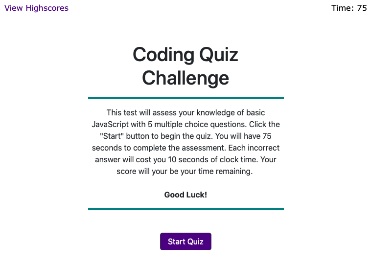

# codeQuiz

## READ ME

### codeQuiz

### Version: 1.0.0

### Web Design By Tripp Parham

### Published: Thursday December 5th 2019

# Description

As a web developer, you will probably be asked to complete a coding assessment. These assessments are typically a combination of multiple-choice questions and interactive challenges. In app challenges the user Javascript with multiple-choice questions. The test is timed and graded at the end. Also, keep high scores to measure improvement.

# Screenshots

# Installation instructions

-   No installation necessary. Any main stream browser can be used.
-   Click the following link:
    https://wilpar4813.github.io/codeQuiz/

# Operating instructions

-   From the home screen you can click "Start Quiz" or "View High Scores"
    -   If you click "Start Quiz", the quiz will start and the user will have 75 seconds to answer 5 questions.
        -   For each correct answer the user will see a "Correct!" message with a green hr or "Wrong!" with a red hr.
        -   If the time runs out the test will end and the final page will appear.
        -   If the user finished the test, the final score along with correct guesses and incorrect guesses is displayed.
            -   The user will be asked to enter initials and submit. Only the first three characters will be used and will be changed to all caps.
            -   The user is taken to the highscore page.
    -   If the user clicks "View High Scores" or after initials are submitted, the highscores page will be displayed.
        -   If the users score is in the top 5, it will appear in the list. The user may then go back to try again or user can clear the highscores.
        -   If the "Clear Highscores" buuon is clicked, the highscores are removed from the page. \* If "Back" button is clicked, the start page re-apears so the process can start over again.

# List of files included in the following structure

-   README.md (Read for information on site development)
-   FORME.md (Development use only)
-   index.html
-   assets folder
    -   style.css
    -   script.js
    -   codeQuiz.png
-   media folder
    -   Audio file - Robot_blip-Marianne_Gagnon-120342607.mp3
    -   Audio file - Smashing-Yuri_Santana-1233262689.mp3
    -   Audio file - service-bell_daniel_simion.mp3

# Copyright and licensing information

-   Bell for correct answers created and licensed by:

    -   About: Customer ringing service bell in need of help in a store.
    -   Title: Service Bell Help
    -   Uploaded: 5.09.18
    -   License: Attribution 3.0
    -   Recorded by Daniel Simion
    -   File Size: 270 KB
    -   Downloads: 191123

-   Bleep sound effect for incorrect answers created and licensed by:

    -   About: A beeping sound that could suit a computer robot or any high-tech apparatus
    -   Title: Robot Blip
    -   Uploaded: 01.11.11
    -   License: Attribution 3.0
    -   Recorded by Marianne Gagnon
    -   File Size: 120 KB
    -   Downloads: 130928

-   Smashing sound effect for game time-out
    -   About: Smash or smashing sound effect. almost sounds like a pumpkin or something like that splattering all over the pavement.
    -   Title: Smashing
    -   Uploaded: 11.09.11
    -   License: Attr-Noncommercial 3.0
    -   Recorded by Yuri Santana
    -   File Size: 315 KB
    -   Downloads: 196952

# Contact Develper

-   Site Developer: Tripp Parham
-   Email: tripp.parham@me.com

# Known bugs[1]

-   If user scores 0 or times out the submit initials field still appears. This need to be changed in the next release.

# Troubleshooting[7]

-   Start button starts the test
-   View Highscores button displays highscore page
-   Questions have been checked to make sure answer is evaluated correctly and that "Correct" and "Wrong" messages are displayed correctly
-   If "View highscores" is clicked before test is over, the test stops and must be started over by hitting the back button. This has been tested.
-   The initials field correctly takes initials, selects the first three characters entered, converts the characters to upper case, and posts to the highscore screen if in the top 5 scores. This has been tested.
-   Test works correctly if restarted during the test.
-   The clear highscores button works correctly.

# Credits and acknowledgments

### Special thanks to the Instructors and Staff at the UNC Coding Bootcamp. They are an awesome team.:-) I recommnend Trilogy to anyone that wants to learn Javascript Web Development. They have a fine tuned program and lots of great resources.

# Site Updates

-   Verion 1.0.0 Released THursday December 5th 2019
